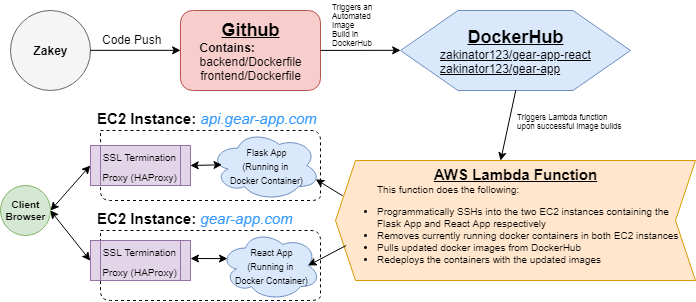

 

  

<a href="http://gear-tracker.com"> gear-tracker.com </a>   A gear inventory system for the Outdoors Club at UVA.

Currently supported on Google Chrome  and Safari only.

## Purpose
Gear Tracker is meant to serve as an improved gear inventory system for the [Outdoors Club at UVA](http://outdoorsatuva.org), which currently keeps track of all of its gear and gear-checkouts on a [Google Spreadsheet](https://docs.google.com/spreadsheets/d/1srgTqgGdCj4B-MhF76eLqVhSWUn_IQ7ww_z1VFIGvAU/edit#gid=935307448) - an inefficient and suboptimal system. Gear Tracker is still being actively worked on. 

Outdoors at UVa has over 1000 different pieces of equipment that members regularly ‘check out’ and borrow for a week at a time. Members come to ‘Gear Rooms’ - times when club officers make our gear storage spaces accessible to all members so that they may check gear out. During gear rooms, members pick out what gear they would like to check out, and list the numbers written on the gear to an officer, who then ‘checks out’ that gear under that member’s name. This application aims to help not only our general members by improving how they view gear, but it also aims to help the officers and Gearmasters with the pressure-ridden task of quickly checking out, checking in, and accessioning large amounts of gear in addition to helping the officers manage our inventory.   Gear Tracker is the first step in an effort to completely overhaul the Outdoors Club's current website, a complex piece of software that's critical to the functioning of UVA's largest student-run organization. To follow the current status of this effort, please visit [this repository](https://github.com/Zakinator123/Outdoors-At-UVa-Website-Spec).
 
## Application Stack and Infrastructure
* Database(s):
    - AWS Aurora instance contains the 'Gear' database, which was created by importing a CSV that was extracted from the current Gear Inventory Spreadsheet.
        * Contains a tables for gear, checkouts, and authenticator tokens (used for managing sessions/authentication).
    - A MySQL database hosted by Pair Networks contains Outdoors at UVA's current website database, which has a 'Members' table that's used to authenticate users in Gear Tracker.

* Back-End: Flask app served with [uWSGI+nginx](http://flask.pocoo.org/docs/1.0/deploying/uwsgi/) on a [docker container](https://hub.docker.com/r/zakinator123/gear-app/~/dockerfile/) running in an AWS EC2 instance. The Flask app is a RESTful JSON API which makes raw SQL queries (via a Python MySQL Client) to the AWS RDS instance mentioned above in addition to the Outdoors Club's MySQL database. HAProxy serves as an SSL Termination Proxy for the Flask App (Config file can be found [here](https://github.com/Zakinator123/Gear-App/blob/master/back-end/haproxy.cfg)), and also takes care of text compression.

* Front-End: ReactJS application running on a different [docker container](https://hub.docker.com/r/zakinator123/gear-app-react/~/dockerfile/) deployed on a different EC2 instance. Contains AJAX calls to the Flask back-end above to populate data tables as well as to make state-changing POST requests (if authenticated) for checking gear in/out. Uses [Material UI Next](https://material-ui-next.com/). HAProxy serves as an SSL Termination Proxy for the React App (Config file can be found [here](https://github.com/Zakinator123/Gear-App/blob/master/front-end/haproxy.cfg)), and also takes care of text compression.
 

## The Automated Deployment System

To expedite the development/deployment cycle, a customized automated deployment system has been set up. Upon any pushes to GitHub, two automated image builds are triggered in their respective DockerHub repositories - these images are for the [Flask back-end](https://hub.docker.com/r/zakinator123/gear-app-react/~/dockerfile/) and [React front-end](https://hub.docker.com/r/zakinator123/gear-app-react/~/dockerfile/) containers. Upon successful image build(s), an [AWS Lambda function](https://github.com/Zakinator123/Gear-App/blob/master/lambda_function.py) is triggered that programmatically SSH's into the EC2 instances containing the Flask and React apps. The programmatic SSH commands take down, update, and redeploy the back-end and front-end containers.
 

## Functional Specifications

General Members:

* Should be able to view the gear inventory in a table that displays the fields of gear items.
    - Filter by:
        - ItemType
        - Status (Checked In/Out)
    - Sort by:
        - Number
        - Condition
        - ItemType

* Should be able to search (autofill preferably) for gear with text input and be able to see a table of results with the same sorting and filtering options as above.

* Should be able to click on any piece of gear and see a modal that shows the gear item’s details as well as information on who has it checked out (and for how long) if it is checked out.

Gearmasters and Officers

* Should be able to do everything General Members can do (above).

* Should be able to view all gear checked out by a specific member (searchable).
 - Renew all/any gear they have checked out
 - Email member about their overdue gear (with press of button)
 - View a member’s gear checkout history and associated check in/out notes
* Should be able to view the checkout history and associated check in/out notes for any given piece of gear (searchable)

* Accession/add new gear into the inventory individually and in bulk (e.g. with many copies of the same brand/model of gear).

* Edit gear values

* Should be able to easily checkout gear to members in bulk.
    - Be able to create a checkout ‘cart’ where gearmaster simply needs to enter a member (autofill search by name/email) and multiple numbers into a form and checkout to member once complete.
    - If items with duplicate numbers exist, gearmaster is prompted to answer which of the items they mean to check out (they are shown a list of the duplicate items’ fields and are able to choose one/many)
    - Write notes about the checkout (per gear)
    - Be alerted to a member having overdue gear when/as they attempt to check gear out to them.

* Should be able to easily check in gear from members in bulk.
    - Be able to create a check-in ‘cart’ where gearmaster simply needs to enter a member (autofill search by name/email) and multiple numbers into a form and check in gear once complete
    - If items with duplicate numbers exist, gearmaster is prompted to answer which of the items they mean to check out (they are shown a list of the duplicate items’ fields and are able to choose one/many)
    - Write notes about the check-in (per gear)

* Should be able to renew a member’s checked out gear (extend the due date)

* View all checked out and overdue equipment
 - Be able to send automatic emails to members
    - Upon gear checkout
    - Individually: When a trip needs gear/gear needs to be recalled.
    - When gear is almost due and gearmaster wants to warn specific problematic member.
    - When gear is overdue and gearmaster wants to email the member.

 - In bulk
    - To all members with overdue gear
    - To all members with gear checked out (e.g. when the semester is almost over.

To Do:
- Need to address the issue of consumable gear???
- Create a ‘maintenance log’ for all pieces of gear.
- Gear entries should have an option to attach a thumbnail image (helpful for identifying ropes, which cannot be reliably tagged or numbered)
- Need to add INNER JOIN to Flask API to get member phone numbers.

## Author

* **Zakey Faieq**
* zaf2xk@virginia.edu

## License

-- This project is licensed under the terms of the [MIT license](https://github.com/Zakinator123/Gear-App/blob/master/LICENSE.txt).
